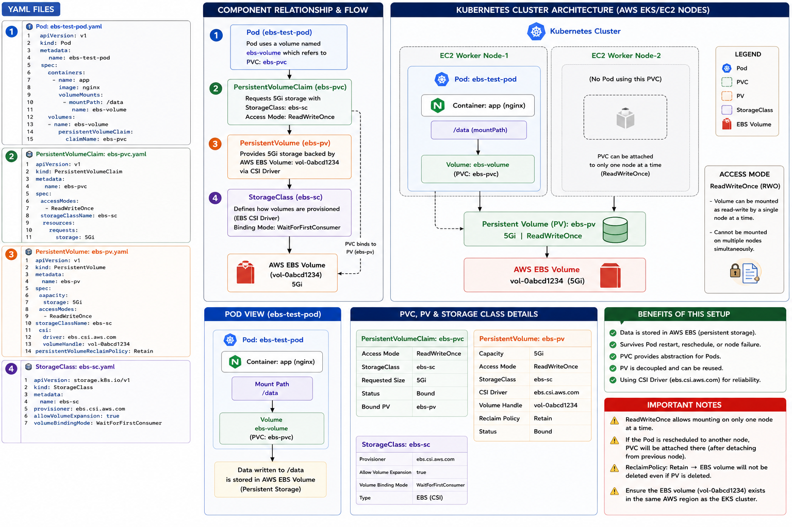

# 🟢 Complete Flow Explanation (PVC + PV + StorageClass + AWS EBS)



[Open image on computer](file:///D:/Roshan%20raj%20Mahato/Desktop/Data%20Analytics/Devops_Srijitha_Maam/K8S/EBS-Volume/EbsPersistanceVolumePersistanceVolumeClaimStorageClass.png)

You have 3 Kubernetes objects:

1. **StorageClass** → Defines how storage should be created
2. **PersistentVolume (PV)** → Actual storage resource
3. **PersistentVolumeClaim (PVC)** → Request for storage

Together they provide:

> Persistent storage for Pods using AWS EBS.

---

# 🟢 STEP 1 — StorageClass Creation

```yaml id="s7k1ez"
apiVersion: storage.k8s.io/v1
kind: StorageClass

metadata:
  name: ebs-sc

provisioner: ebs.csi.aws.com

allowVolumeExpansion: true
```

---

# 🟢 What Happens?

Kubernetes creates a:

```text id="8v9d6k"
StorageClass = ebs-sc
```

This StorageClass says:

```text id="9uwr5n"
"Whenever storage is requested,
use AWS EBS CSI Driver."
```

---

# 🟢 Important Part

```yaml id="jlwmws"
provisioner: ebs.csi.aws.com
```

This is the AWS EBS CSI Driver.

It knows how to:

* Create EBS volumes
* Attach EBS volumes
* Mount volumes to nodes

---

# 🟢 At This Stage

No storage created yet.

Only rules are created.

---

# 🟢 Architecture Now

```text id="2z9pmo"
Kubernetes Cluster
        │
        ▼
StorageClass (ebs-sc)
        │
        ▼
AWS EBS CSI Driver
```

---

# 🟢 STEP 2 — PersistentVolume (PV) Creation

```yaml id="ck3fnw"
apiVersion: v1
kind: PersistentVolume

metadata:
  name: ebs-pv

spec:
  capacity:
    storage: 5Gi

  accessModes:
    - ReadWriteOnce

  storageClassName: ebs-sc

  csi:
    driver: ebs.csi.aws.com
    volumeHandle: vol-0abcd1234

  persistentVolumeReclaimPolicy: Retain
```

---

# 🟢 What Happens?

Kubernetes creates a PV object.

This PV represents:

```text id="46t74u"
Actual AWS EBS Disk
```

---

# 🟢 MOST IMPORTANT PART

```yaml id="nl5ktl"
volumeHandle: vol-0abcd1234
```

This is the real AWS EBS volume ID.

Example in AWS:

```text id="xd7ibx"
EBS Volume:
vol-0abcd1234
```

Kubernetes links this EBS disk to the PV.

---

# 🟢 Flow

```text id="1n3j4c"
AWS EBS Disk
(vol-0abcd1234)
        │
        ▼
PersistentVolume (ebs-pv)
```

---

# 🟢 accessModes

```yaml id="7fxb6s"
ReadWriteOnce
```

Means:

> Only one node can mount this volume at a time.

Perfect for EBS because:

AWS EBS supports single-node attachment.

---

# 🟢 persistentVolumeReclaimPolicy

```yaml id="93bqu9"
Retain
```

Means:

If PVC is deleted:

✅ Data remains safe
✅ EBS volume not deleted

---

# 🟢 STEP 3 — PVC Creation

```yaml id="gkv77r"
apiVersion: v1
kind: PersistentVolumeClaim

metadata:
  name: ebs-pvc

spec:
  accessModes:
    - ReadWriteOnce

  storageClassName: ebs-sc

  resources:
    requests:
      storage: 5Gi
```

---

# 🟢 What Happens?

Developer says:

```text id="g96znf"
"I need 5Gi storage."
```

PVC is just a storage request.

---

# 🟢 Kubernetes Starts Matching

Kubernetes checks:

| PVC Requirement | PV Check        |
| --------------- | --------------- |
| 5Gi             | 5Gi ✅           |
| ReadWriteOnce   | ReadWriteOnce ✅ |
| ebs-sc          | ebs-sc ✅        |

Everything matches.

---

# 🟢 Binding Happens

PVC automatically binds to PV.

---

# 🟢 Flow

```text id="n6tv3k"
PVC (ebs-pvc)
        │
        ▼
Binds to
        │
        ▼
PV (ebs-pv)
        │
        ▼
AWS EBS Volume
```

---

# 🟢 STEP 4 — Pod Uses PVC

Now Pod uses PVC:

```yaml id="2t0vbf"
volumes:
- name: ebs-volume
  persistentVolumeClaim:
    claimName: ebs-pvc
```

---

# 🟢 What Happens Internally?

Kubernetes:

1. Finds PVC
2. PVC already bound to PV
3. PV connected to AWS EBS
4. EBS attached to worker node
5. Mounted inside container

---

# 🟢 Real Runtime Flow

```text id="dizj1m"
Pod Created
    │
    ▼
PVC Found
    │
    ▼
PVC Bound to PV
    │
    ▼
PV Linked to EBS Volume
    │
    ▼
AWS Attaches EBS to Node
    │
    ▼
Kubelet Mounts Volume
    │
    ▼
Container gets /data
```

---

# 🟢 Actual AWS Flow

```text id="zk9om9"
Kubernetes
    │
    ▼
AWS EBS CSI Driver
    │
    ▼
AWS API Call
    │
    ▼
Attach EBS Volume
(vol-0abcd1234)
to EC2 Instance
```

---

# 🟢 Final Architecture

```text id="rj6gbw"
                    Kubernetes Cluster

        ┌──────────────────────────────────┐
        │          StorageClass            │
        │             ebs-sc              │
        └───────────────┬──────────────────┘
                        │
                        ▼

              AWS EBS CSI Driver
                        │
                        ▼

        ┌──────────────────────────────────┐
        │       Persistent Volume          │
        │             ebs-pv               │
        └───────────────┬──────────────────┘
                        │
                        ▼

        ┌──────────────────────────────────┐
        │        AWS EBS Volume            │
        │        vol-0abcd1234             │
        └───────────────┬──────────────────┘
                        │
                        ▼

        ┌──────────────────────────────────┐
        │ PersistentVolumeClaim (PVC)      │
        │             ebs-pvc              │
        └───────────────┬──────────────────┘
                        │
                        ▼

                EC2 Worker Node
                        │
                        ▼

                    Pod
                      │
                      ▼

              Container:/data
```

---

# 🟢 VERY IMPORTANT UNDERSTANDING

| Object       | Responsibility            |
| ------------ | ------------------------- |
| StorageClass | How storage is created    |
| PV           | Actual storage resource   |
| PVC          | Request for storage       |
| EBS Volume   | Real AWS disk             |
| CSI Driver   | Connects Kubernetes ↔ AWS |

---

# 🟢 Full Lifecycle

```text id="0lytr4"
StorageClass Created
        │
        ▼
PV Created
(Connected to EBS)
        │
        ▼
PVC Requests Storage
        │
        ▼
PVC Binds to PV
        │
        ▼
Pod Uses PVC
        │
        ▼
EBS Attached to Node
        │
        ▼
Mounted inside Container
        │
        ▼
Application Stores Data
```

---

# 🟢 If Pod Gets Deleted?

✅ Data survives

Because:

Data is stored in AWS EBS, not inside container.

---

# 🟢 If Pod Moves to Another Node?

Kubernetes:

1. Detaches EBS from old node
2. Attaches EBS to new node
3. Mounts volume again

Data remains safe.

---

# 🟢 Interview Explanation

> StorageClass defines how AWS EBS storage should be provisioned using the EBS CSI driver.
>
> PersistentVolume represents the actual EBS disk.
>
> PersistentVolumeClaim is a user request for storage.
>
> Kubernetes binds PVC to a matching PV, then attaches the EBS volume to the worker node where the Pod is running and mounts it inside the container.
